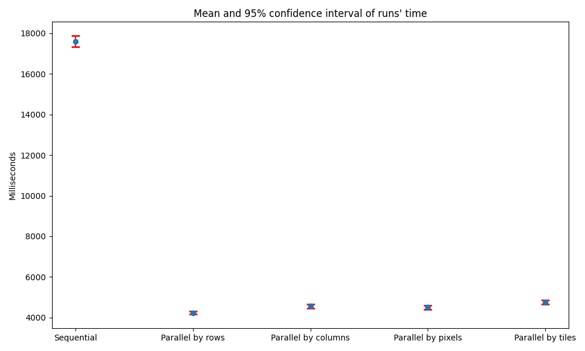
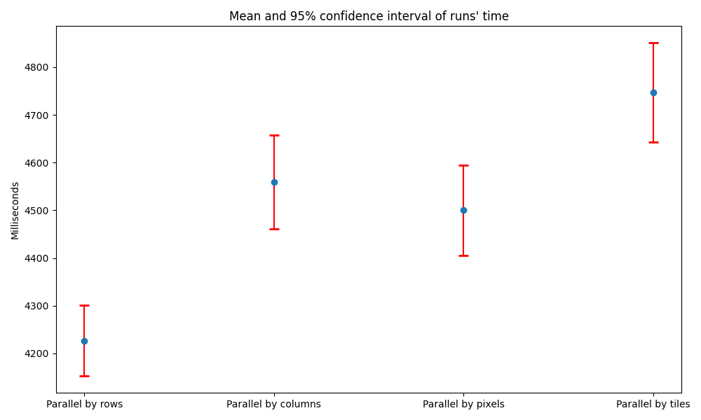
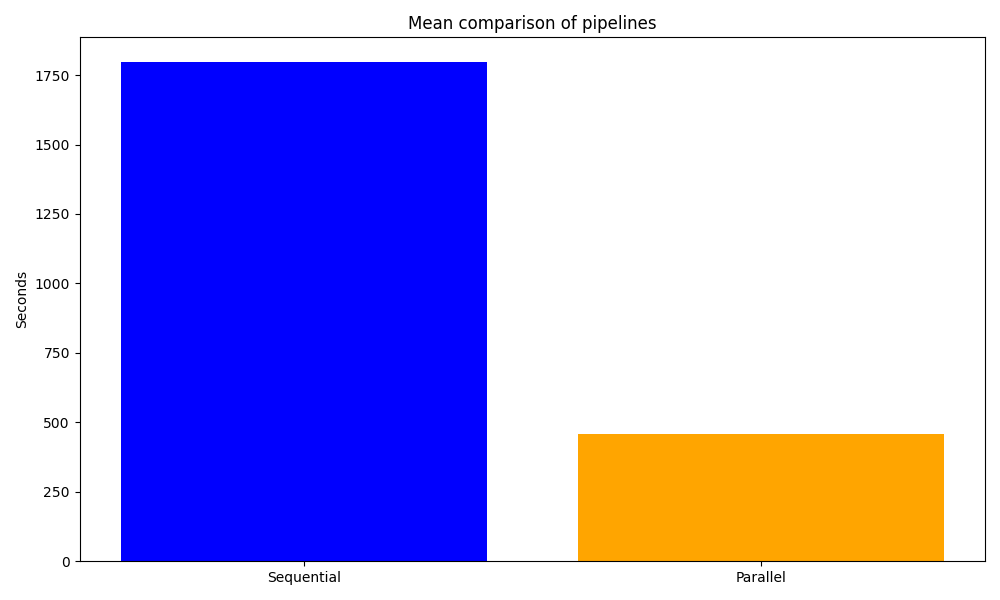

# BMP Convolution console app
This console app provides ability to convolve RGB BMP images.
## Table of contents
* [Author](#author)
* [Functionality](#functionality)
* [File structure](#filestructure)
* [Requirements](#requirements)
* [Technologies used](#technologies)
* [Usage](#usage)
* [Performance analysis](#perf)
* [License](#license)
* [Acknowledgements](#acknowledgements)
## Author <a name="author"></a>
Vyacheslav Kochergin. [GitHub](https://github.com/VyacheslavIurevich), [Telegram](https://t.me/se4life). 
## Functionality <a name="functionality"></a>
There are five convolution implementations: sequential and 4 parallel. Convolution is paralleled by: rows, columns, pixels and tiles of given size.
Sequential and parallel pipeline for array of images were implemented.
Supported filters list: `id`, `blur-3x3`, `blur-5x5`, `gaussian-blur-3x3`, `gaussian-blur-5x5`, `motion-blur`, `find-horizontal-edges`, `find-vertical-edges`, `find-inclined-edges`, `find-all-edges`, `first-sharpen`, `second-sharpen`, `third-sharpen`, `emboss-3x3`, `emboss-5x5`, `mean`.
You can observe filters' effects at `src/test/resources/ref_out`.
## File structure <a name="filestructure"></a>
```
├──src
│  ├──main/kotlin
│  │  ├──App.kt                        # main app with CLI
│  │  ├──BMPHandler.kt                 # BMP reader & writer
│  │  ├──ConvolutionImplementation.kt  # enum of convolution implementations
│  │  ├──ConvolutionSolver.kt          # convolution algorithm
│  │  ├──FilteringInfo.kt              # filter, factor & bias
│  │  ├──ImageTask.kt                  # task for pipeline
│  │  ├──ImagesProcessingPipeline.kt   # parallel pipeline
│  ├──test
│  │  ├──kotlin/ConvolutionsTests.kt   # tests for ConvolutionSolver
│  │  ├──resources
│  │  │  ├──in                         # inputs for testing & benchmarking
│  │  │  ├──ref_out                    # reference outputs for testing
```
## Requirements <a name="requirements"></a>
* [JDK 21+](https://adoptium.net/temurin/releases/)
* [Kotlin 2.0.21](https://kotlinlang.org/)
* [Gradle 8.12.1](https://gradle.org/)
## Technologies used <a name="technologies"></a>
* [JavaCV](https://github.com/bytedeco/javacv)
* [ktlint](https://github.com/pinterest/ktlint)
## Usage <a name="usage"></a>
Run interactive mode via
```shell
gradle run --console=plain
```
Run benchmark of big dataset via
```shell
gradle run --args="--bench" --console=plain
```
Run benchmark of one picture via
```shell
gradle run --args="--benchpic" --console=plain
```
Run autotests via
```shell
gradle test
```
## Performance analysis <a name="perf"></a>
Two experiments were conducted.
1. Comparison of sequential and parallel implementations on big.bmp picture.
2. Comparison of sequential and paralell pipeline on big BMP dataset.

Conditions:
* OS: Kubuntu 25.04
* CPU: 12th Gen Intel(R) Core(TM) i5-1235U with 12 CPUs
* RAM: 8 Gb
### Implementations comparison
Research question: which implementation of convolution works faster on big.bmp sample picture?

Options:
* 32x32 tile size
* `emboss-5x5` filter

25 runs of each implementation were made. 


Graphs show us confidence intervals of mean values of working time. 
As we can see, parallel by rows is the most fast implementation for big.bmp.
### Pipelines comparison
Research question: does parallel pipeline work faster than sequential on big dataset?

Options:
* `emboss-5x5` filter
* 32x32 tile size
* 10 max queue size
* 2 reader threads
* 8 worker threads
* 2 writer threads

3 runs of each pipeline were made.

Graph shows us mean values of working time of pipelines.
We can easily conclude that parallel pipeline works much faster.
## License <a name="license"></a>
See [LICENSE.md](./LICENSE.md)
## Acknowledgements <a name="acknowledgements"></a>
Sequential algorithm, filters and sample taken from [Lode's Computer Graphics Tutorial](https://lodev.org/cgtutor/filtering.html). Big 1500 BMPs dataset taken from [Mendeley Data](https://data.mendeley.com/datasets/sp4g8h7v8k/1), distributed under [CC-BY 4.0](https://creativecommons.org/licenses/by/4.0/deed.ru).
